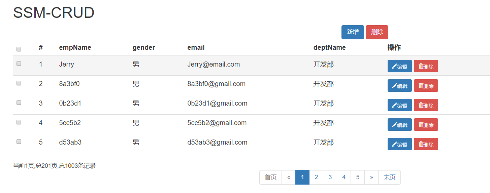

# SSMCRUD

-----------------------

### 功能点

1. 分页

2. 数据校验

   + jQuery前端校验(正则表达式、ajax查重)
   + JSR303后端校验——**Hibernate Validation**

3. ajax异步请求

4. Rest风格的URI

   > 使用HTTP协议请求方式的动词来表达对资源的操作

   + **GET**:查询 (http://localhost:8080/crud/emp/{id})
   + **POST**：新增 (http://localhost:8080/crud/emp)
   + **PUT**：更新 (http://localhost:8080/crud/{empId})
   + **DELETE**：删除 (http://localhost:8080/crud/{ids})


### 技术点

1. 后端框架:**SpringMVC**、**Spring**、**Mybatis**
2. 数据库：**Mysql**
3. 前端框架:**BootStrap**、**jQuery**
4. 项目依赖管理：**Maven**
5. 逆向工程：**Mybatis Generator**
6. 分页：**MyBatis** 分页插件 **PageHelper**


###  查询

1. 访问**index.jsp**页面
2. **index.jsp**页面发送出查询员工列表请求
3. **EmployeeController**来接收请求，查出员工数据放入**Model**
4. **pageHelper**分页插件完成分页
5. 通过视图解析器解析出目标页面地址
6. 跳转页面


###  查询-ajax方式

1. **index.jsp**页面直接发送ajax请求解进行员工分页数据的查询
2. 服务器将查出的数据，以**json**字符串的形式返回给浏览器，**实现客户端的无关系**
3. 浏览器接收到**json**字符串。使用**js**对**json**解析解析，使用**js**通过**dom**增删改查改变页面


### 新增

1. 在**index.jsp**页面点击"新增"按钮
2. 弹出新增对话框
3. 去数据库查询部门列表，显示到对话框中
4. 用户输入数据，进行校验
   + **jQuery**前端校验
   + **ajax**用户名重复校验
   + 重要数据(后端JSR303，唯一约束)；
5. 完成保存(**Spring**的声明式事务)


### 修改

1. 点击编辑
2. 弹出用户修改的模态框(显示用户信息)
3. 用户输入数据，进行校验
4. 点击更新，完成用户修改


###  删除

1. 单个删除
2. 批量删除


### 注意的问题

1. **ajax**发出**PUT**请求时，**Tomcat**不会封装请求体中的数据为**Map**

   + **解决**:配置一个**FormContentFilter**过滤器

2. **Web**路径问题，不以**/**开始的相对路径，以当前的路径为基准，经常容易出问题

   + **解决**:以/开始的相对路径，找资源，以服务器的路径为标准(http://localhost:8080)加上项目名     http://localhost:8080/crud/

   `````jsp
   <%
        pageContext.setAttribute("APP_PATH", request.getContextPath());
   %>
   <script type="text/javascript" src="${APP_PATH}/static/js/jquery-3.4.1.min.js"></script>
   `````


### 总结

1. BootStrap和jQuery还得多用用，基础的前端框架还是要熟悉的
2. 通过这个项目发现Mybatis的逆向工程还是很好用的，以后要多用，简便开发
3. 学习了分页插件PageHelper
4. Junit也能测试controller层的接口，以前都是通过Postman测试的


### 项目截图

